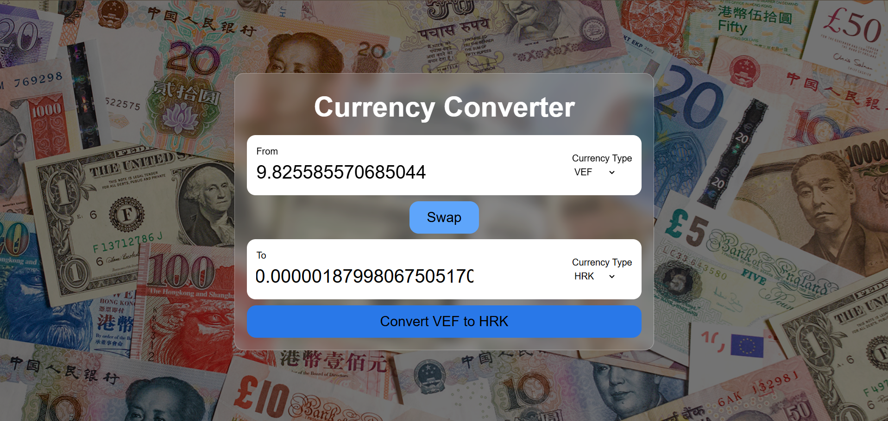

## 💱 Advanced Currency Converter

In this project, I have built an **advanced currency converter** that converts currencies using **real-time exchange rates**.

---

## 🚀 Key Topics Used

### 1️⃣ Custom Hook
- Created a **custom React hook** to trigger the API call whenever the selected currency changes.
- This helps keep the logic **reusable, clean, and separated** from UI components.

### 2️⃣ Props
- Used **props** to make a single input component reusable.
- The same component dynamically handles different currency values and inputs.

### 3️⃣ Map Method
- Used the **`map()` method** to dynamically generate currency options.
- Currency selections are populated from the API response instead of being hard-coded.

---

## 🛠️ Features
- Real-time currency conversion
- Dynamic currency selection
- Clean and reusable component structure
- Scalable React architecture

