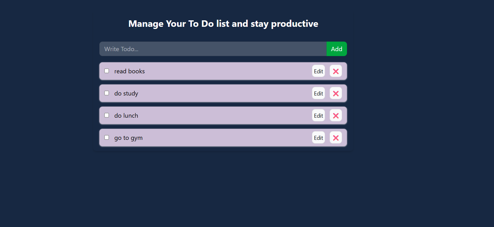

# 📝 Todo Management App (React)

This project is a **simple yet powerful Todo Management application** built using **React**.  
It helps users **add, update, delete, and manage tasks efficiently**, with data persistence using **localStorage**.

This project was created to **strengthen core React concepts** like state management, Context API, and component reusability.

---

## 🚀 Features

- ➕ Add new todos  
- ✏️ Update existing todos  
- ❌ Delete todos  
- ✅ Mark todos as completed  
- 💾 Persistent data using **localStorage**  
- ⚡ Fast and responsive UI  
- ♻️ Global state management using **Context API**

---

## 🛠️ Technologies & Concepts Used

- **React.js**
- **React Hooks**
  - `useState`
  - `useEffect`
  - `useContext`
- **Context API** for global state management
- **localStorage** for data persistence
- **Functional Components**
- **Immutable state updates**
- **Tailwind CSS** for styling

---

## 🧠 Key Learnings from this Project

- Managing global state using **Context API**
- Persisting data using **localStorage**
- Correct usage of `map`, `filter`, and immutable updates
- Handling side effects with `useEffect`
- Safely initializing state from localStorage
- Structuring a scalable React application

---

## 📂 Project Structure

```bash
src/
│── components/
│   ├── TodoForm.jsx
│   ├── TodoItem.jsx
│
│── context/
│   ├── index.js
│
│── App.jsx
│── main.jsx


```



